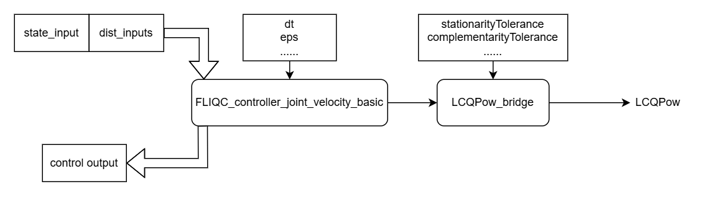

# FLIQC_controller_core

This is the C++ library for FLIQC (Fast LInear Quadratic Complementarity) motion planner for robot controllers.



## Installation

It is suggested to install this package from the whole example repository [FLIQC_example_workspace_ros](https://github.com/hwyao/FLIQC_example_workspace_ros), which contains all the submodule for this repository.

If you really want to install this package individually:
1. clone this repository with recursive submodules.
```bash
git clone --recursive https://github.com/hwyao/FLIQC_controller_core
```
2. Build the library with CMake.
```bash
mkdir build
cd build
cmake ..
cmake --build .
```

## Quick Start

If you only run this as standalone library, you can run the example code.

```bash
Example_LCQPow
Example_LCQPow_bridge
```

The documentation for most important classes are:
- [FLIQC_controller_core::FLIQC_controller_joint_velocity_basic](https://hwyao.github.io/projects-documentation/FLIQC_controller_core/class_f_l_i_q_c__controller__core_1_1_f_l_i_q_c__controller__joint__velocity__basic.html)
- [FLIQC_controller_core::LCQPow_bridge](https://hwyao.github.io/projects-documentation/FLIQC_controller_core/class_f_l_i_q_c__controller__core_1_1_l_c_q_pow__bridge.html)

## Documentation

You can view the online documentation at the link at the right side of this main page.

The documentation can be generated with Doxygen with the following command after installing Doxygen.
```bash
cd docs
doxygen Doxyfile
```

## Links

The submodule used in our project, LCQPow, a C++ library for solving linear quadratic complementarity problems:
[https://github.com/nosnoc/LCQPow](https://github.com/nosnoc/LCQPow) 

Our previous version of code during the experiment development:
[https://github.com/hwyao/LCQP_planner_core](https://github.com/hwyao/LCQP_planner_core)

